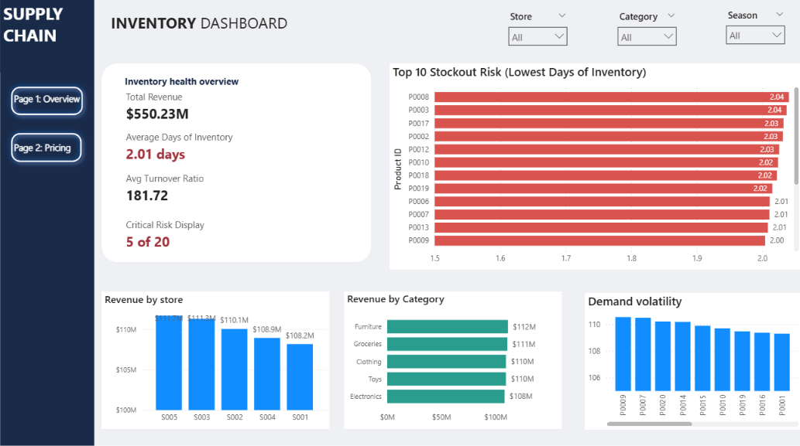

# Supply Chain & Inventory Optimization

A retail inventory analysis project I built to practice the full analyst workflow — from raw data to a working Power BI dashboard. This isn't a tutorial copy-paste; every number here came from queries I wrote and re-checked myself, including a couple of formula mistakes I caught and fixed along the way (documented below, because those were honestly the most useful part of doing this).

## The question I was trying to answer

A retail chain has 5 stores, 20 products, and two years of daily sales/inventory data. Leadership wants to know: **which products are at risk of running out, which ones are sitting overstocked, and is the current forecasting/discounting approach actually working?**

## Dataset

- Retail Store Inventory Forecasting Dataset (Kaggle) — synthetic but structured like real POS + inventory data
- 73,100 rows | Jan 2022 – Jan 2024 | 5 stores | 20 products | 5 categories

## Tools

- **Excel / Power Query** — cleaning, validation, feature engineering
- **MySQL Workbench** — 15 business-question queries
- **Power BI** — 2-page dashboard with DAX measures

## What's in this repo

```
data/
  raw/        → original CSV, untouched
  cleaned/    → with Revenue, Forecast Error, Price Gap columns added
sql/
  queries.sql → all 15 queries, commented
  results.md  → each query's actual output + what it means
dashboard/    → .pbix file
```

## How I got here (short version)

Cleaned the raw CSV in Excel/Power Query first — checked nulls, duplicates, and one thing that doesn't show up in a standard "data quality" checklist: whether `Units Sold` ever exceeded `Inventory Level` on any row (it didn't, across all 73,100 rows — good sign the data wasn't garbage).

Added three columns that didn't exist in the raw data but were needed for everything downstream: Revenue (Units Sold × Price), Forecast Error (Units Sold − Demand Forecast), and Price Gap (Price − Competitor Pricing). Tried exporting these from Power BI's table visual first — hit its export sampling limit and silently lost ~43,000 rows without realizing it until a row count check flagged it. Redid it as plain Excel formulas on the raw file instead, which doesn't have that limit.

Then moved to SQL for the actual analysis (15 questions, listed in `sql/results.md`), and Power BI for the dashboard.

## The mistake worth mentioning

My first pass at Inventory Turnover Ratio came out at **~18,000** — obviously wrong for a retail turnover metric. Traced it back to comparing a 2-year *cumulative* sales total against a *single-snapshot* inventory average — a scale mismatch. Same issue showed up again in the DAX version of the same measure in Power BI (fixed there with `AVERAGEX` + `SUMMARIZE` to force it to compute per-product-per-store before averaging). Corrected version landed at ~180, which is still lean for retail but at least in a believable range. Leaving this in because catching a scale mismatch is a more useful skill to show than never having one.

## What the data actually showed

- **Average Days of Inventory is ~2 days**, across nearly all 100 product-store combinations — not just a few outliers. Typical retail sits at 15–45 days.
- **Demand volatility (standard deviation) is almost as large as average demand itself** (~80% coefficient of variation) — so it's not just that stock is low, it's that daily demand is genuinely unpredictable, which makes the thin buffer worse.
- **Every single product is being over-forecasted**, not under — yet inventory still runs critically low. That's the part that doesn't fit a simple story: it points at a gap between what's forecasted and what's actually ordered, not a forecasting-accuracy problem.
- **Discounting doesn't behave consistently** — 7 of 20 products actually sell *fewer* units on discount days. The current flat ~12.5% discount isn't earning its cost everywhere.
- **Store, category, and seasonal performance are all fairly even** (within ~3%) — so none of the above is a "one bad store" or "one bad season" story. It's structural.

Full question-by-question breakdown with actual output is in `sql/results.md`.

## Recommendations

1. Increase safety stock, starting with the highest-revenue / highest-risk product-store pairs (e.g. P0015 at S005, 1.86 days on hand) rather than spreading buffer evenly.
2. Look at the forecast-to-order handoff, not the forecasting model — the model isn't the thing that's broken.
3. Replace the blanket discount with a per-product one, since roughly a third of the catalog loses money on it for no sales gain.

## Dashboard

**Page 1 — Overview:** KPIs (revenue, DOI, turnover, at-risk count), top-10 stockout risk, revenue by store/category, demand volatility.



**Page 2 — Pricing & Discount Analysis:** discount lift by product, price gap vs. competitor, forecast direction split.


## Honest limitations

- No `Lead Time` field in the dataset, so Reorder Point isn't calculated as a hard number here — DOI and the stockout-risk ranking are used as the practical stand-in.
- This is synthetic data, so patterns like "discount has no consistent effect" may reflect how the dataset was generated rather than real consumer behavior. Flagged that in the discount analysis rather than overstating it.
